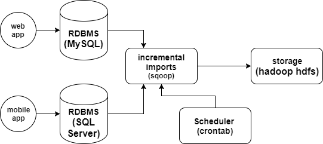

# Hadoop Sqoop Incremental Aggregations

## Problem

Assume we have web and mobile applications that store their data into RDBMS like databases (e.g. MySQL, SQL Server, ect.). As the data grows, processing it in RDBMS environments is a bottleneck. If the data is very huge, RDBMS is not feasible. That is where distributed systems help.  For this, we need to bring the data to distributed systems then it becomes easy to process it. The data fetching process should also be fast.

Bringing data to distributed system is not that tedious job, if we have to bring the data from one database. But, in general business applications use different kind of databases. Following are the few problems we would face while bringing data directly.

* Data cannot be fetched in parallel
* Need to maintain multiple connectors for different databases
* Code maintenance
* Time for code development
* Need to import data to local then copy it to distributed file systems (Two Step).
* If we are fetching data incrementally, the last fetched value should be stored and maintained manually.
* If we want to load data into Hive or HBase, we would need to write different programs and need to maintain them.
* We need to create tables before hand.
* Cleansing of data should be done separately.
* If we need data in specialized file formats, we need to convert with an additional step.

## Solution (proposition):

For all the challenges mentioned previously, manual intervention is often required. We need a solution that would take care most of the things to make the data fetching process easy. Sqoop is the tool helps in bulk transferring the data between RDBMS database systems and distributed systems.  [Sqoop](http://sqoop.apache.org/) will take care of all the above problems mentioned. It provides simple command line option, where we can fetch data from different database systems by writing the simple Sqoop command.

## Solution Architecture 



## Prerequisites

* Hadoop
* Sqoop
* RDBMS (for this project, MySQL is used as a data source)

## Create a database and table 

Let's say we have a table in a MySQL database that contains guests information data (first name, last name, email, etc.). And we would like to import the table's data into Hadoop HDFS as well as keeping the same process in timely basis (automated / scheduled imports). 

The guests database, guest_info table as well as the data in it can be done by:

* Connecting to MySQL and creating guests database

```sql
CREATE DATABASE guests;
```

* Then quit MySQL and run the following [SQL script]() in the command line as follows:


```
$ mysql -h hostname -u root -p < path/to/sql_script.sql
```

Or just do all the steps manually on MySQL 

```sql
CREATE DATABASE guests;

CREATE TABLE guest_info (
	id INT(6) UNSIGNED AUTO_INCREMENT PRIMARY KEY,
	firstname VARCHAR(30) NOT NULL,
	lastname VARCHAR(30) NOT NULL,
	email VARCHAR(50),
	visit_date TIMESTAMP
);

INSERT INTO guest_info (firstname, lastname, email) 
VALUES ('Teri','Thomas','t_thomas@gmail.com'), 
('Clifford','Gonzalez','c_gonzalez@gmail.com'),
('Faith','Lamb','f_lamb@gmail.com');
```

## Connect and explore the data source 

Now, on the other side of the world as a data engineer you want remotely connect, explore, ... ect. the data to be loaded into Hadoop HDFS before writing your Sqoop job. As a first step, you may want to list all the databases that exist in MySQL, we could use the following command:

```linux
sqoop list-databases --connect jdbc:mysql://localhost/ --username root --password 123456
```

Then all tables within the guests database

```linux
sqoop list-tables --connect jdbc:mysql://localhost/guests --username root --password 123456
```

## Data aggregation

After having the database's credentials for connecting as well you having explored the data, now it's time to fetch the data into Hadoop HDFS. The Following command will do the job:

```linux
$ sqoop import --connect jdbc:mysql://localhost/guests --username root --password 123456 --table guest_info -m 2 --split-by id --target-dir /tmp/data_staging/guest_info --fields-terminated-by '\001'
```

Options used are:

* **--connect** takes JDBC URL and connects with the database provided in the URL
* **--username** username to be connected into database
* **--password** password for the user
* **--table** Source table from which data needs to be imported
* **-m** number of mappers to launch in parallel
* **--split-by** split the mappers based on this column
* **--target-dir** stores the imported data into a specified directory
* **--fields-terminated-by** imported data is delimited with this.

Check whether the data that has been imported into Hadoop HDFS: 

```linux
$ hadoop dfs -cat /tmp/data_staging/guest_info/*
```

Wait!! The data in the MySQL database is increasing, so we want a way to check for new data and only fetch that data into Hadoop HDFS. **Incremental import** is a technique that imports only the newly added rows. It is required to add the following options perform the incremental import:

* **incremental** Imports newly added data
* **check-column** the column in which to be checked 
* **last-value** the value where to start the import (avoid fetching data that is already on Hadoop HDFS)

Before, let's add new data into MySQL guest_info table to be imported later:

```sql
INSERT INTO guest_info (firstname, lastname, email) VALUES ('Jery','Raj','jraj@gmail.com');
``` 

So the syntax that is used for the incremental option in Sqoop import is as follows:

```linux 
$ sqoop import --connect jdbc:mysql://localhost/guests --username root --password 123456 --table guest_info -m 2 --split-by id --target-dir /tmp/data_staging/guest_info --fields-terminated-by '\001' --check-column visit_date --incremental append --check-column id --last-value 4
```

## Scheduling 

Here we are going to schedule the previous command using Crontab, so we don't have to write the same thing every time we want to import the data. The command can be scheduled following these steps:

* Create

```linux
$ nano sqoop_job.sh
``` 

* Copy paste this script

```bash
#!/bin/bash
PASS=123456

# Get the max id of yesterday's data 
ID=$(mysql -u root -p$PASS guests -s -N -e 'SELECT MAX(id) FROM guest_info WHERE DATE(visit_date)=DATE(SUBDATE(NOW(),1));')

# Import the data into Hadoop HDFS
sqoop import --connect jdbc:mysql://localhost/guests --username root --password $PASS --table guest_info -m 2 --split-by id --target-dir /tmp/data_staging/guest_info --fields-terminated-by '\001' --incremental append --check-column id --last-value $ID
```

* Schedule the job using crontab

```linux
$ crontab -e
```

Then at this at the end (e.g. imports done every day at 6am)

```
0 6 * * * /path/to/job.sh
```

Boom we are done!

## End notes 

To conclude, Sqoop helps in transferring bulk data between RDBMS systems and Distributed Systems very optimally.  It reduces the unnecessary efforts of the developers in coding and maintaining the code. As Sqoop transfers the data in parallel, the data transfer is also very fast.  Because of its contributors and support, Sqoop helps very much in the Hadoop world.